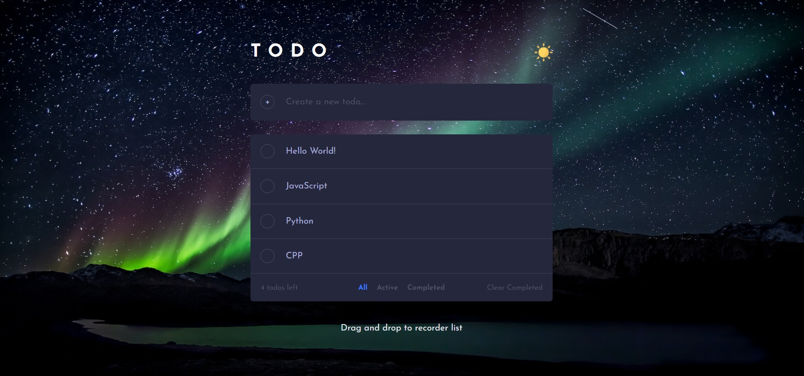
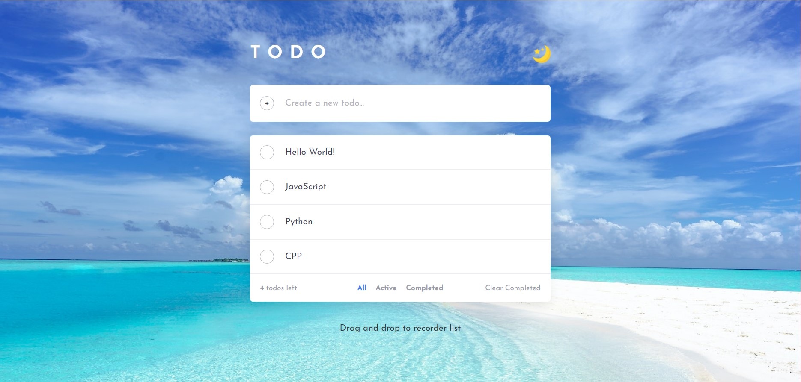
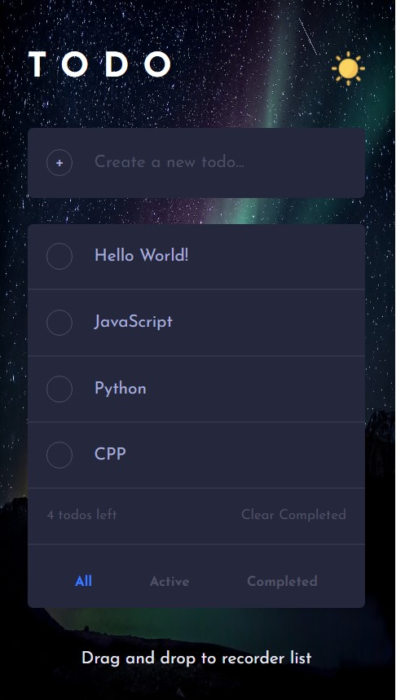
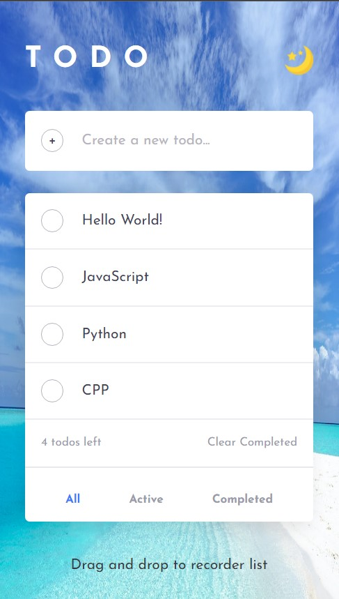

# TODO APP

## [Link](http://ec2-54-169-36-218.ap-southeast-1.compute.amazonaws.com/)

## Screenshots

---

- 1440px-dark-theme

---

- 1440px-light-theme

---

- 375px-dark & light theme

| Dark                                                                             | Light                                                                             |
| -------------------------------------------------------------------------------- | --------------------------------------------------------------------------------- |
|  |  |

---

## Users should be able to:

- Create new todos
- Delete todos
- Drag todos
- Store todos in the MongoDB
- Filter by all/active/complete todos
- Toggle light and dark mode

---

## Build With

### Frontend

- HTML
- CSS  
  Flexbox  
  Grid  
  MediaQuery
- JavaScript  
  DOM manipulate  
  EventListener  
  Fetch request

### Backend

- Node.js
- httpServer
- RestfulApi
- middleWare  
  Cors  
  Parser
- Mongoose

### Deployment

- Amazon EC2(Linux)  
  PM2  
  Nginx

---

## Ref

[TODO APP using HTML, CSS and JS - Local Storage [Design - HTML and CSS]](https://dev.to/hariramjp777/todo-app-using-html-css-and-js-local-storage-design-html-and-css-1m0j)  

[TODO APP using HTML, CSS and JS - Local Storage [Interactivity - JavaScript]](https://dev.to/hariramjp777/todo-app-using-html-css-and-js-local-storage-interactivity-javascript-3f3a)

[Lessons learned from deploying my first full-stack web application](https://www.freecodecamp.org/news/lessons-learned-from-deploying-my-first-full-stack-web-application-34f94ec0a286/)